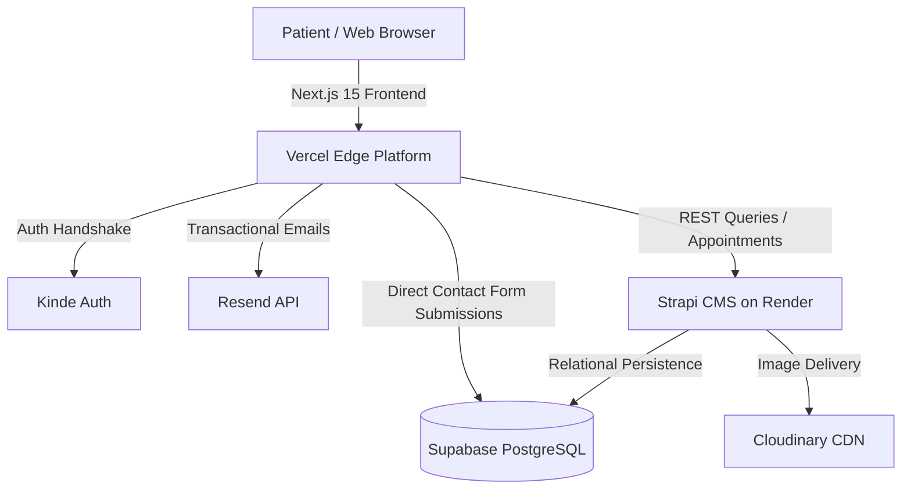

# 🦷 Glowing Smiles — Doctor Appointment Booking Platform

[](https://nextjs.org/)
[](https://react.dev/)
[](https://strapi.io/)
[](https://supabase.com/)
[](https://tailwindcss.com/)
[](https://kinde.com/)
[](https://resend.com/)

A modern, full-stack medical appointment scheduling web application designed for **Glowing Smiles Doctors & Clinic**. Built with **Next.js 15 (App Router)**, **React 19**, **Strapi v4 Headless CMS**, **Supabase PostgreSQL**, **Kinde Authentication**, and **Resend Transactional Emailing**.

---

## 🌐 Live Demos

* **Live Web Application:** [https://doctor-appointment-booking-web-nextjs-two.vercel.app](https://doctor-appointment-booking-web-nextjs-two.vercel.app)
* **Backend API (Strapi CMS):** [https://doctor-appointment-admin-strapi-0459.onrender.com](https://doctor-appointment-admin-strapi-0459.onrender.com)
* **Backend Repository:** [Doctor-Appointment-Admin-Strapi](https://github.com/singhtechie24/doctor-appointment-admin-strapi)

---

## ✨ Key Features

* **Real-Time Slot Collision Prevention:** Dynamic query validation prevents double-booking by fetching scheduled consultations in real-time and disabling occupied slots.
* **Time-Aware Availability:** Automatically disables past time slots for current-day bookings based on real-time client timestamps.
* **Doctor Discovery & Multi-Field Search:** Real-time search across medical specialties (Dentist, Cardiologist, Neurologist, etc.) and doctor names.
* **Enterprise Authentication (Kinde Auth):** Route middleware protection, social login, and secure server session verification.
* **Automated Confirmation Emails:** Powered by **Resend** with responsive JSX email templates sent upon appointment confirmation.
* **Contact Inquiry Pipeline:** Functional patient inquiry form with server-side error sanitization and direct persistence into cloud **PostgreSQL**.
* **Cloud Asset Management:** Doctor portraits and category vectors delivered via **Cloudinary**.
* **Responsive Modern UI:** Built with **Tailwind CSS**, **Radix UI** primitives, and custom SVG branding.

---

## 🏗️ System Architecture



---

## 🛠️ Tech Stack

| Layer | Technology |
| :--- | :--- |
| **Frontend Framework** | Next.js 15.5 (App Router) |
| **UI Library** | React 19.3 & React DOM 19 |
| **Styling** | Tailwind CSS 3.4 & PostCSS 8 |
| **Component Primitives** | Radix UI (Dialog, Popover, Tabs, Slot) & Lucide Icons |
| **Headless CMS** | Strapi v4 (Node 20 runtime) |
| **Database** | PostgreSQL hosted on Supabase (with Session Pooler) |
| **Authentication** | Kinde Auth (@kinde-oss/kinde-auth-nextjs 2.13) |
| **Email Service** | Resend API (v6) |
| **Media Storage** | Cloudinary |
| **Deployment** | Vercel (Frontend) & Render (Backend) |

---

## 🚀 Local Development Setup

### 1. Clone Repositories
```bash
git clone https://github.com/singhtechie24/Doctor-Appointment-Booking-Web-Nextjs.git
git clone https://github.com/singhtechie24/doctor-appointment-admin-strapi.git
```

### 2. Configure Frontend (`frontend/.env.local`)
```env
NEXT_PUBLIC_STRAPI_BASE_URL=http://localhost:1337
NEXT_PUBLIC_STRAPI_API_KEY=your_strapi_api_token

# Kinde Auth
KINDE_CLIENT_ID=your_kinde_client_id
KINDE_CLIENT_SECRET=your_kinde_client_secret
KINDE_ISSUER_URL=https://your-domain.kinde.com
KINDE_SITE_URL=http://localhost:3000
KINDE_POST_LOGOUT_REDIRECT_URL=http://localhost:3000
KINDE_POST_LOGIN_REDIRECT_URL=http://localhost:3000

# Resend Email Service
RESEND_API_KEY=your_resend_api_key

# PostgreSQL (Supabase)
DATABASE_HOST=aws-1-eu-west-1.pooler.supabase.com
DATABASE_PORT=5432
DATABASE_NAME=postgres
DATABASE_USERNAME=your_db_user
DATABASE_PASSWORD=your_db_password
DATABASE_SSL=true
```

### 3. Install & Run
```bash
# In frontend directory
npm install
npm run dev

# In backend directory
npm install
npm run develop
```

Frontend runs at `http://localhost:3000` and Strapi CMS runs at `http://localhost:1337`.

---

## 🛡️ Security Highlights
* **Zero Credential Exposure:** Server-side environment variables (`DATABASE_PASSWORD`, `KINDE_CLIENT_SECRET`, `RESEND_API_KEY`) are isolated from the client bundle.
* **Public Error Sanitization:** Database exceptions and connection errors are logged exclusively to secure server consoles without leaking stack traces to the public UI.

---

## 📄 License
This project is open source and available under the [MIT License](LICENSE).
